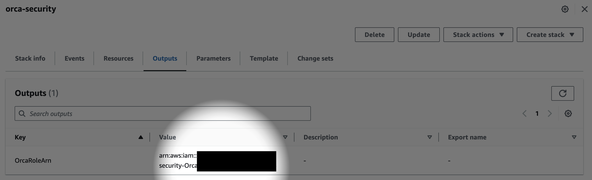
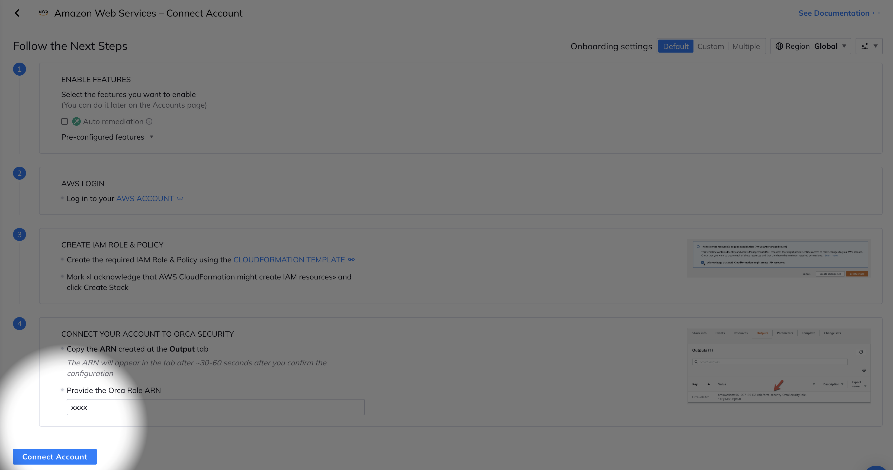

# Orca Security AWS onboarding quick note
## Full scan
In order to connect your AWS Account with Orca Security, you need to create 6 customer managed IAM policies and 1 AWS managed policy - you can find a CloudFormation temaplate [here](https://github.com/hisashiyamaguchi/note-orca-security-aws-onboarding/blob/main/globalDefaultPolicy.json).
  
 

 
 

  
  

 Once the stack has been created, grab your ARN and put it on Orca UI, and hit "Connect Account". Your AWS Account is going to be connected with your Orca Tenant, and the initial scanning is going to start automatically.
  
 

 
  
  
 
 

  
  

## Control plane only scan
If you want to scan only control plane for your AWS Account, Orca backend team can configure to skip data plane scanning for your AWS Account.

1. Create Orca IAM Role with a pre-defined [CloudFormation template](https://github.com/hisashiyamaguchi/note-orca-security-aws-onboarding/blob/main/globalDefaultPolicy.json). Once the stack has been created, grab your ARN.
  
 

 
 

  

2. Onboard your AWS Account with your Orca Tenant via [API](https://docs.orcasecurity.io/docs/create-cloud-account). You need to put your **"name", "display_name", "aws$role_arn", "external_id"** . As for **"external_id"**, contact Orca representative - he/she can give your external_id.
 

 

3. Orca backend team is going to configure data plane scanning skip with a special tuning parameter. Once it's completed, any snapshots are not going to be taken, and any data plane scannings are not going to be happened on your AWS Account. 
 
 

#  Issue Reporting
If you have found a bug or if you have updates request, please report them at this repository issues section.